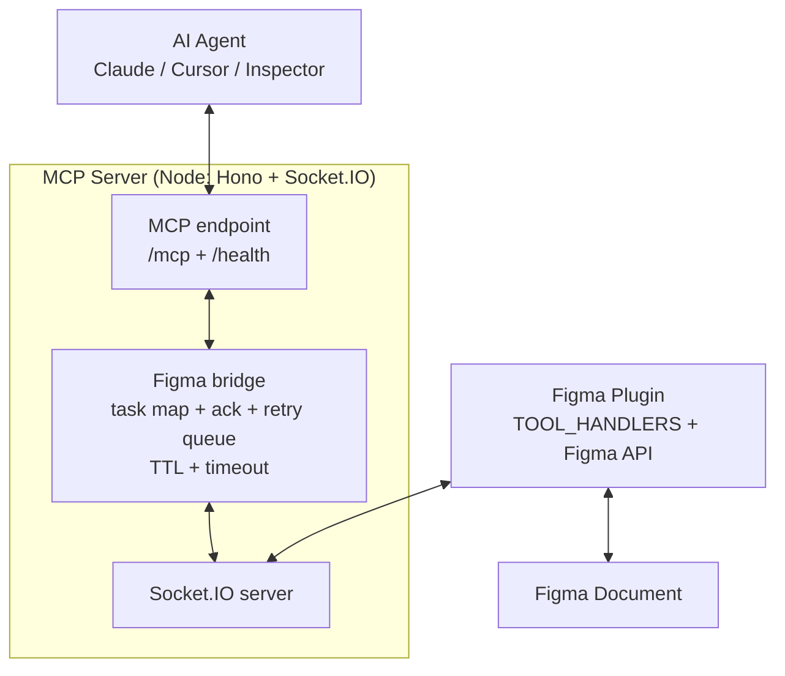
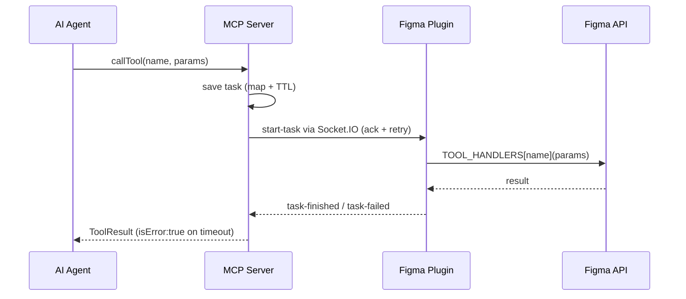

# Fimake

[](https://github.com/chavisnguyen/FiMake/releases)
[](./LICENSE)

## Problem

The official Figma MCP server is read-only. **You cannot change anything in the Figma document with it.**
Chatting in Figma Make and then moving the result back to Figma to continue is inconvenient.

**Fimake lets AI agents work directly in your Figma documents** — create, edit, organize, and read.

## Install for users (5 minutes, no repo clone)

Prerequisites: `Node.js >= 22`, Figma Desktop, an MCP client (Claude Code / Cursor / Claude Desktop).

### 1. Install the Figma plugin (sideload, once)

Fimake ships as a **dev plugin** (sideload from manifest). There is no Figma Community listing — the plugin needs a local socket bridge (`localhost:10101`), which Figma does not allow for published listings. This is the same model as other MCP bridges.

1. Download `fimake-plugin.zip` from [GitHub Releases](../../releases) and unzip it.
2. In Figma: *Plugins > Development > Import plugin from manifest*, select `manifest.json` from the unzipped folder.
3. Run it via *Plugins > Development > Fimake*. Expected: **Not connected to MCP server**.
4. **Keep the plugin window open.** It flips to **Connected** once the MCP server (step 2) is running.

> Compatibility: use the plugin zip and the binary from the **same release** (e.g. both `v1.0.x`). Default port is `10101` on both sides.

### 2. Run the MCP server (pick one)

> Pick **one**: either your client spawns the server (`stdio`, A/B/C below — you run nothing by hand) **or** you run it yourself (`streamable-http`, advanced). Never both — two servers fight over port `10101` and the second one crashes. When in doubt, run `fimake doctor`.

**A. Homebrew (macOS / Linux, no Node needed).** Tap is auto-bumped on every release:

```bash
brew tap chavisnguyen/fimake
brew install fimake
fimake --version
fimake doctor   # expect "[ok] port ... is free"
```

```json
{
  "mcpServers": {
    "fimake": {
      "command": "fimake",
      "env": { "TRANSPORT": "stdio", "PORT": "10101" }
    }
  }
}
```

Update with `brew upgrade fimake`.

**B. Standalone binary (no Node needed).** Download `fimake-<your-os>` from [GitHub Releases](../../releases) (`fimake-macos-arm64`, `fimake-macos-x64`, `fimake-linux-x64`), make it executable (`chmod +x fimake-*` on macOS/Linux), then point your client at it:

```json
{
  "mcpServers": {
    "fimake": {
      "command": "/absolute/path/to/fimake-macos-arm64",
      "env": { "TRANSPORT": "stdio", "PORT": "10101" }
    }
  }
}
```

**C. From source (contributors).** Clone, build once, point at the local file (needs `Node.js >= 22`):

```bash
git clone https://github.com/chavisnguyen/FiMake.git
cd FiMake && make install && make build
```

```json
{
  "mcpServers": {
    "fimake": {
      "command": "node",
      "args": ["/absolute/path/to/FiMake/mcp/dist/index.js"],
      "env": { "TRANSPORT": "stdio", "PORT": "10101" }
    }
  }
}
```

Where to put the config:

- **Claude Code / generic client / Inspector:** paste into your MCP config.
- **Cursor:** `~/.cursor/mcp.json` or project `.cursor/mcp.json`.
- **Claude Desktop:** `claude_desktop_config.json`.
- **Opencode** (`~/.config/opencode/opencode.json`) — different shape, same idea:

```json
{
  "mcp": {
    "fimake": {
      "type": "local",
      "command": ["fimake"],
      "enabled": true,
      "environment": { "TRANSPORT": "stdio", "PORT": "10101" }
    }
  }
}
```

Then restart the client if it requires it and ask something like *"list the pages in this Figma file"*. The plugin window should show the task appear and settle (`Task started: get-pages ...` → `Task finished: ...`).

### Alternative: `streamable-http` (advanced)

Use this only if your client requires an HTTP endpoint (or you want the Inspector over HTTP). You run the server yourself and point the client at a URL:

```bash
TRANSPORT=streamable-http ./fimake-macos-arm64
# serves http://localhost:10101/mcp
```

```json
{
  "mcpServers": {
    "fimake": { "url": "http://localhost:10101/mcp" }
  }
}
```

Full client configs, env table, and custom `PORT` checklist live in [docs/usage.md](docs/usage.md).

📖 **Hosted docs:** [chavisnguyen.github.io/FiMake](https://chavisnguyen.github.io/FiMake) — same content with search, sidebar, and diagrams (deployed from `docs/` via VitePress + GitHub Pages).

| Guide | When to read it |
|---|---|
| [Quickstart](docs/quickstart.md) | 5-minute install (plugin + server + client config) |
| [docs/usage.md](docs/usage.md) | Full setup, HTTP + `stdio` configs, env table, custom `PORT` |
| [docs/tools.md](docs/tools.md) | All 32 tools reference |
| [docs/architecture.md](docs/architecture.md) | Bridge, task map, diagrams, security |
| [docs/troubleshooting.md](docs/troubleshooting.md) | `Not connected`, port in use, timeouts, logs |
| [docs/development.md](docs/development.md) | Contributor guide: `make` targets, watch mode, tests, architecture |

## Tools

32 tools: 25 forward directly to the plugin (`name` = task command), 7 have extra Node-side logic.

Every tool accepts `targetFileKey` / `targetFileName` to pin a task to one open Figma file — call `list-clients` first, omit both to broadcast (see [docs/tools.md](docs/tools.md#multi-window-targeting)).

| Tool | Side | Description |
|---|---|---|
| `create-rectangle` | plugin | Create a rectangle. |
| `create-frame` | plugin | Create a frame. |
| `create-text` | plugin | Create a text. |
| `create-instance` | plugin | Create an instance. |
| `create-component` | plugin | Create a component. |
| `clone-node` | plugin | Clone a node. |
| `add-component-property` | plugin | Add a component property. |
| `add-prototype-link` | plugin | Add a prototype interaction (click to navigate) between two nodes. |
| `get-node-info` | plugin | Lean layout/colors/content. `depth`: 0 = node only, N = N levels, -1 = full subtree. `maxNodes` (default 10000) + `maxChars` (default 35000) cap size; overflow becomes `_truncated` stubs with `childrenTruncated: true` and root `_truncatedCount` — re-request flagged ids. `fields` limits groups. |
| `get-pages` | plugin | Get all pages in the current file. |
| `get-all-components` | plugin | Get all components in the current file. |
| `move-node` | plugin | Move a node. |
| `resize-node` | plugin | Resize a node. |
| `set-fill-color` | plugin | Set a solid fill color (`#RRGGBBAA`; alpha `00` = transparent). |
| `set-fill-gradient` | plugin | Replace the fill with a `LINEAR` (default) or `RADIAL` gradient: 2–16 `stops` `{position 0..1, color}`, `angle` (LINEAR, degrees: 0 = left→right, 90 = top→bottom). |
| `set-stroke-color` | plugin | Set the stroke (border): `color`, optional `weight` (px) and `align` (`INSIDE`/`OUTSIDE`/`CENTER`). |
| `set-effects` | plugin | Replace all effects: `DROP_SHADOW`/`INNER_SHADOW` (`color` with alpha, `offset`, `radius`, `spread`) and `LAYER_BLUR`/`BACKGROUND_BLUR` (`radius`). `[]` clears. |
| `set-corner-radius` | plugin | Set the corner radius of a node. |
| `set-layout` | plugin | Set the layout of a node. Turning auto-layout on keeps a FIXED frame's size on any axis whose `layoutSizing*` is omitted (Figma would default to HUG). |
| `set-parent-id` | plugin | Move a node into a parent or reorder it. `index` = position among children (0 = bottom of z-order, omit = append); `absolute` = ABSOLUTE positioning inside an auto-layout parent (overlays). |
| `set-instance-properties` | plugin | Set the properties of an instance. |
| `edit-component-property` | plugin | Edit a component property. |
| `set-node-component-property-references` | plugin | Set the component property references of a node. |
| `delete-node` | plugin | Delete a node. |
| `delete-component-property` | plugin | Delete a component property. |
| `get-selection` | node+plugin | Get the current selection in Figma. No params; returns whole TaskResult. |
| `create-image` | node+plugin | Fetches `url` in Node (no CORS), forwards `imageData` bytes to plugin. |
| `create-svg` | node+plugin | Editable vector from SVG: exactly one of `svg` (inline), `url` (fetched in Node, same SSRF guards as `create-image`), `filePath` (local `.svg`). Keeps intrinsic size; `x`/`y`/`parentId` place it. Max 5MB, rejects `<!ENTITY`. |
| `set-image-fill` | node+plugin | Use an image (`url`, fetched in Node like `create-image`) as the fill of an EXISTING node; `scaleMode` `FILL`/`FIT`/`CROP`/`TILE`. |
| `export-asset` | node+plugin | Rendered asset with real path data (`SVG` markup or `PNG`/`JPG` base64, `scale` max 4). With `outputPath`, writes to disk and returns `{path, bytes}` (max 20MB). |
| `export-file` | node-only | Fans out over `get-pages` + `get-node-info` and writes one JSON per top-level frame + `manifest.json`. Params: `outputDir` (default `<cwd>/exports/export-<ts>`), `maxNodes` (default 5000), `maxChars` (default 35000). Guarded: max 500 frames, all writes confined to `outputDir`. No plugin handler by design. |
| `list-clients` | node-only | List open Figma files with the plugin connected (`fileName`, `fileKey`, `connectedAt`). No plugin handler by design. |

Contract parity is enforced by `mcp/tests/contract/mcp-tools.test.ts` and `NODE_ONLY_TOOLS` in `mcp/src/tools/registry.ts`.

## Install for contributors

```bash
make install   # pnpm install (mcp + plugin)
make check     # pre-push gate: typecheck + lint + test + build
make dev-mcp    # watch + restart the MCP server
make dev-plugin # watch + rebuild the plugin (re-import it in Figma to reload)
```

See [docs/development.md](docs/development.md) for the full guide. After a plugin rebuild, **re-import** it in Figma — Figma does not hot-reload the bundle.

## Architecture

Socket.IO is the bridge between the MCP server and the Figma plugin.

MCP server runs a *Hono (Node)* server with MCP endpoints plus a *Socket.IO* server for the plugin.
It saves tool calls into a task map and sends `start-task` over WebSockets with ack + retry queue.

The Figma plugin listens on the WebSocket, dispatches via `TOOL_HANDLERS`, runs the Figma API, and returns the result.
Only page-fan-out tools call `figma.loadAllPagesAsync()`; single-node tools skip it.

Timed-out tasks resolve `isError:true`. Stale queued messages expire via TTL + max retries. StreamableHTTP creates one `McpServer` per client session sharing a single Figma bridge, so sessions can't leak into each other.





## Security

The plugin gives AI agents access to your open Figma document, similar to the official Figma MCP server. It runs on your local machine and does not send data anywhere else by itself — exposure depends on which AI client you connect.

- Local use is the default. For any networked use, set `CORS_ORIGIN` explicitly, review `networkAccess.allowedDomains` in `plugin/manifest.json`, and proceed at your own risk.
- `export-file`/`export-asset` writes are confined to the requested output dir (no `../` escape, no filesystem-root writes, frame count + byte caps).

Found a security issue? Please report it via GitHub issue.

## Alternatives

If your tasks are read-only, use the [official Figma MCP server](https://help.figma.com/hc/en-us/articles/32132100833559-Guide-to-the-Figma-MCP-server).

A known community alternative built on the same plugin-plus-socket idea is [cursor-talk-to-figma-mcp](https://github.com/grab/cursor-talk-to-figma-mcp) (plain JavaScript, separate socket server). Fimake differs with TypeScript, a single server (MCP + bridge on one `PORT`), and contract-tested tools.
