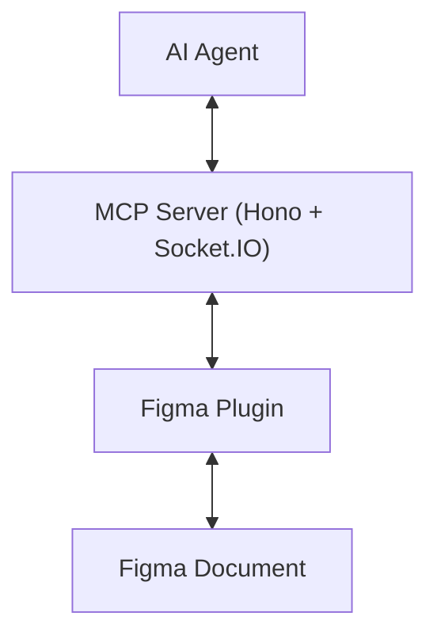

# Fimake

[](https://github.com/chavisnguyen/FiMake/releases)
[](./LICENSE)

## Problem

The official Figma MCP server is read-only. **You cannot change anything in the Figma document with it.**
Chatting in Figma Make and then moving the result back to Figma to continue is inconvenient.

**Fimake lets AI agents work directly in your Figma documents** — create, edit, organize, and read.

## Install (5 minutes)

Prerequisites: Figma Desktop + an MCP client (Claude Code / Cursor / Claude Desktop / Opencode). No Node needed.

### 1. Install the CLI

```bash
brew tap chavisnguyen/fimake
brew install fimake
```

Brew prints the next step after install (`caveats`). No Homebrew? Download `fimake-<your-os>` from [GitHub Releases](../../releases) instead.

### 2. Install the Figma plugin

```bash
fimake install-plugin
```

This downloads the matching plugin and registers it with Figma Desktop (macOS). If Figma is running, it asks to quit it once (Figma only saves its plugin registry on quit).

Then: reopen Figma → *Plugins > Development > Fimake*. Expected: **Not connected to MCP server**. **Keep this window open.**

> Not on macOS, or prefer manual? Unzip `fimake-plugin.zip` from [Releases](../../releases) and *Import plugin from manifest* ([manual steps](docs/troubleshooting.md#install-the-plugin-manually)). Use the plugin zip and the CLI from the **same release**.

### 3. Connect your AI client

Your client spawns the server itself — you run nothing by hand. Add this to your MCP config and restart the client:

```json
{
  "mcpServers": {
    "fimake": {
      "command": "fimake",
      "env": { "TRANSPORT": "stdio", "PORT": "10101" }
    }
  }
}
```

Opencode (`~/.config/opencode/opencode.json`) uses a different shape — see [Quickstart](docs/quickstart.md). Then ask *"list the pages in this Figma file"*. The plugin window should flip to **Connected** and show the task settle.

Stuck? Run `fimake doctor`, then see [Troubleshooting](docs/troubleshooting.md).

| Guide | When to read it |
|---|---|
| [Quickstart](docs/quickstart.md) | Same 3 steps with per-client configs |
| [docs/usage.md](docs/usage.md) | Env vars, custom `PORT`, HTTP mode (advanced) |
| [docs/tools.md](docs/tools.md) | All 35 tools reference |
| [docs/troubleshooting.md](docs/troubleshooting.md) | `Not connected`, port in use, timeouts |
| [docs/development.md](docs/development.md) | Contributors: `make` targets, watch mode, tests |
| [docs/architecture.md](docs/architecture.md) | Bridge, task map, diagrams, security |

## Tools

35 tools: 28 forward directly to the plugin (`name` = task command), 7 have extra Node-side logic (image fetching, file export, client listing). Every tool accepts `targetFileKey` / `targetFileName` to pin it to one open Figma file — see [docs/tools.md](docs/tools.md).

## Install for contributors

```bash
make install   # pnpm install (mcp + plugin)
make check     # pre-push gate: typecheck + lint + test + build
```

See [docs/development.md](docs/development.md). Note: with `stdio` your client spawns its own server — don't also run one by hand on the same port.

## Architecture (one paragraph)

Socket.IO bridges the MCP server and the Figma plugin on one `PORT` (`10101`): the server queues each tool call as a task, the plugin runs it via the Figma API and replies. Details + diagrams: [docs/architecture.md](docs/architecture.md).



## Security

Local-only by default; the plugin exposes your open Figma document to whichever AI client you connect (same trust model as the official Figma MCP). For networked use set `CORS_ORIGIN` explicitly — see [docs/architecture.md](docs/architecture.md#security).
