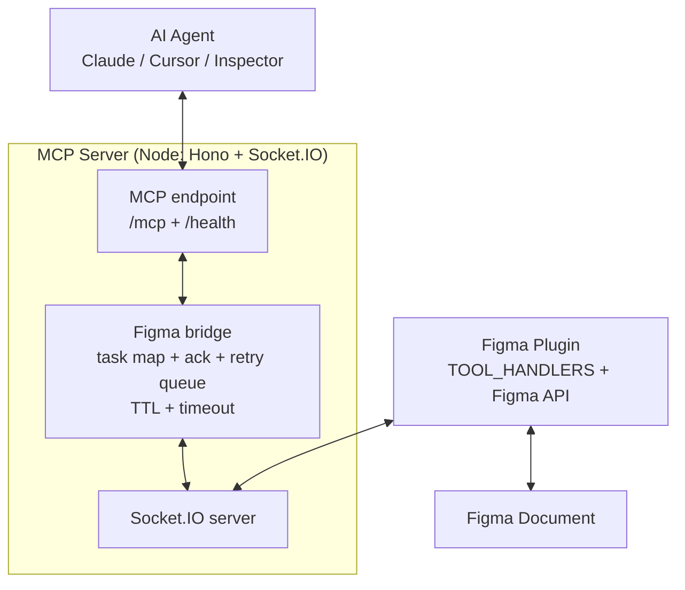
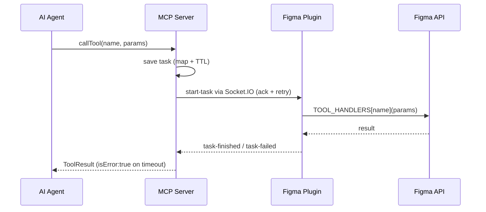

# Architecture

Socket.IO is the bridge between the MCP server and the Figma plugin.

MCP server runs a *Hono (Node)* server with MCP endpoints plus a *Socket.IO* server for the plugin.
It saves tool calls into a task map and sends `start-task` over WebSockets with ack + retry queue.

The Figma plugin listens on the WebSocket, dispatches via `TOOL_HANDLERS`, runs the Figma API, and returns the result.
Only page-fan-out tools call `figma.loadAllPagesAsync()`; single-node tools skip it.

Timed-out tasks resolve `isError:true`. Stale queued messages expire via TTL + max retries. StreamableHTTP creates one `McpServer` per client session sharing a single Figma bridge, so sessions can't leak into each other.

## Code map

For contributors changing code, see [Development](./development.md). Quick map:

- `mcp/src/index.ts` — entrypoint; picks `TRANSPORT` (`stdio` vs `streamable-http`).
- `mcp/src/bridge/` — `TaskManager` (timeouts), `Orchestrator`, `createMcpServer` (tool registration).
- `mcp/src/transport/` — `stdio.ts`, `streamable-http.ts` (`/mcp` + `/health`), `socket-server.ts`, `socket-manager.ts` (ack + retry queue), `mcp-sessions.ts`.
- `mcp/src/tools/`, `mcp/src/config/`, `mcp/src/shared/log.ts` (`[fimake]` prefix).
- `plugin/main/` — Figma sandbox: `TOOL_HANDLERS` dispatch, reply `task-finished` / `task-failed`.
- `plugin/ui/` — React status pill + console.
- `plugin/shared/` — zod schemas shared by both sides.
- `plugin/manifest.json` — dev-plugin manifest; `networkAccess.allowedDomains` must cover the server `PORT`.

## Security

The plugin gives AI agents access to your open Figma document, similar to the official Figma MCP server. It runs on your local machine and does not send data anywhere else by itself — exposure depends on which AI client you connect.

- Local use is the default. For any networked use, set `CORS_ORIGIN` explicitly, review `networkAccess.allowedDomains` in `plugin/manifest.json`, and proceed at your own risk.
- `export-file`/`export-asset` writes are confined to the requested output dir (no `../` escape, no filesystem-root writes, frame count + byte caps).

Found a security issue? Please report it via GitHub issue.

## Alternatives

If your tasks are read-only, use the [official Figma MCP server](https://help.figma.com/hc/en-us/articles/32132100833559-Guide-to-the-Figma-MCP-server).

A known community alternative built on the same plugin-plus-socket idea is [cursor-talk-to-figma-mcp](https://github.com/grab/cursor-talk-to-figma-mcp) (plain JavaScript, separate socket server). Fimake differs with TypeScript, a single server (MCP + bridge on one `PORT`), and contract-tested tools.
